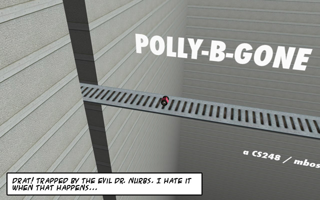
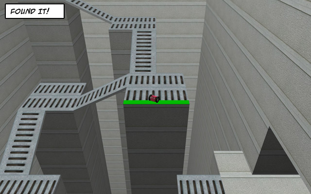
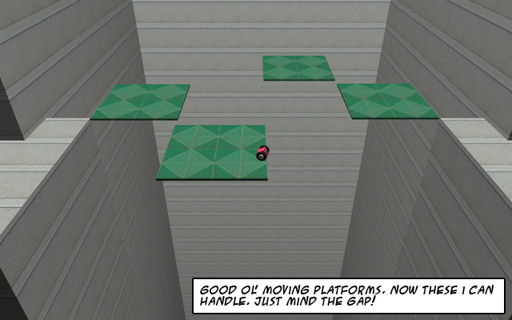
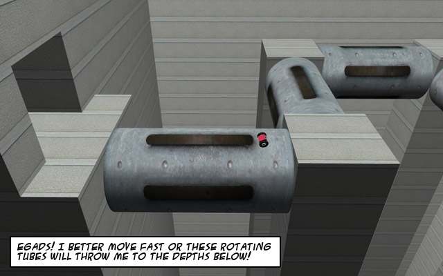
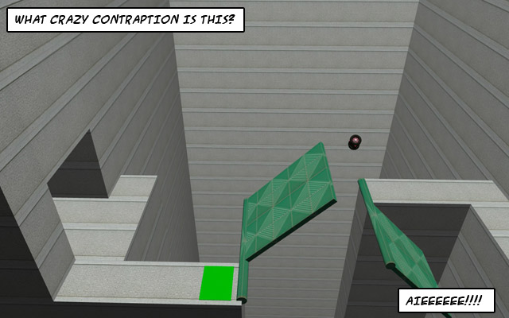
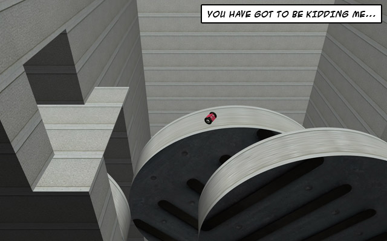

# Polly-B-Gone

[https://www.cs.stanford.edu/people/mbostock/polly/](https://web.archive.org/web/20240707143904/https://www.cs.stanford.edu/people/mbostock/polly/)

**Polly-B-Gone** is a 3D physics platform game that tells the story of a plucky wheeled robot named Polly, who has been imprisoned by the nefarious Dr. Nurbs in his laboratory. Polly must overcome a series of increasingly-elaborate obstacles to escape and regain her freedom. Polly was my entry in the 2008 [CS 248](https://web.archive.org/web/20240707143904/http://graphics.stanford.edu/courses/cs248-08/) video game competition, and she won the grand prize!

## Screenshots








## Documentation

The entire game world for Polly-B-Gone is specified as an XML file. You can edit world.xml to create new levels, new puzzles, and even change the music, textures and lighting! See the [full specification](doc/xml-format.html) or [wiki](https://github.com/mbostock/polly-b-gone/wiki) for details.

## Building

The following dependencies are required for building on Ubuntu/Debian:
```
sudo apt install \
  build-essential \
  autoconf \
  automake \
  pkg-config \
  libgl1-mesa-dev \
  libglu1-mesa-dev \
  libgles2-mesa-dev \
  libglut-dev \
  libsdl1.2-dev \
  libsdl-image1.2-dev \
  libsdl-mixer1.2-dev \
  libtinyxml-dev
```

## Third-Party Content

[Texturama](http://texturama.com/) provided the textures for the ceramic, concrete, and drain materials. These images are copyright XY3D, Texturama, and Eric Brian Smith and may not be redistributed for any other purpose without the permission of the copyright holders. The clover and ivy textures are from the [Blender for Architecture](http://blender-archi.tuxfamily.org/) website and are distributed via the Creative Commons Attribution License version 2.5. The MIDI files for the background music come from the "Very Best of GUS MIDI" collection, which is available from the SDL_mixer website (see above). According to the compilation author, "all of these MIDI files are freely distributable, but most of them are copyrighted."
